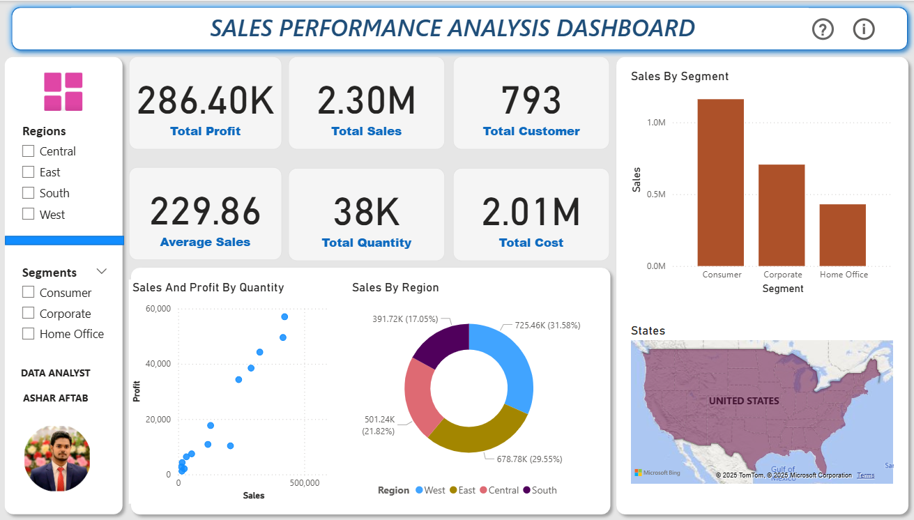

# 📊 Sales Performance Analysis Dashboard

## 📌 Project Overview
This project is an **interactive Sales Performance Analysis Dashboard** built in **Power BI**, using the *Sample - Superstore* dataset.  
The dashboard provides valuable insights into sales performance across different regions, customer segments, and product categories.

It showcases **KPIs, DAX measures, and multiple visualizations** for better decision-making.

---

## 📷 Dashboard Preview

---

## 🔹 Key Features
- **KPIs**:
  - Total Profit
  - Total Sales
  - Total Customers
  - Average Sales
  - Total Quantity
  - Total Cost
- **Interactive Filters**:
  - Region Filter (Central, East, South, West)
  - Segment Filter (Consumer, Corporate, Home Office)
- **Visualizations**:
  - Sales by Segment (Bar Chart)
  - Sales and Profit by Quantity (Scatter Plot)
  - Sales by Region (Donut Chart)
  - Sales by State (Map)
- **DAX Calculations**:
  - Created measures for Total Quantity, Total Sales, Total Profit, and more.

---

## 📊 Summary Metrics (from Dashboard)
| Total Profit | Total Sales | Total Customers | Average Sales | Total Quantity | Total Cost |
|--------------|-------------|-----------------|--------------|---------------|------------|
| 286,397.02   | 2,297,201   | 793             | 229.86       | 38,000+       | 2,010,804  |

---

## ⚙ Tools & Technologies
- **Power BI**
- **DAX**
- **CSV Data Processing** (Python for preprocessing)
- **Data Visualization**

---

## 🚀 How to Use
1. Download the `.pbix` file from this repository.
2. Open it in **Power BI Desktop**.
3. Interact with filters and slicers to explore insights.

---
## 📬 Author  
**Ashar Aftab**  
📧 Email: [asharaftab2004@gmail.com](mailto:asharaftab2004@gmail.com)  
🔗 LinkedIn: www.linkedin.com/in/ashar-aftab-b09924295

---

## 📜 License  
This project is free for educational and non-commercial use.  
Feel free to fork, improve, and give credit where due.

---

## 🗂️ Dataset Source

Click Here to Get Dataset: https://drive.google.com/file/d/1I_zipkgwK541NOM46vmSi_3w-ep_fJV7/view?usp=drive_link

---

> If you found this project useful or insightful, consider giving it a ⭐ on GitHub!

